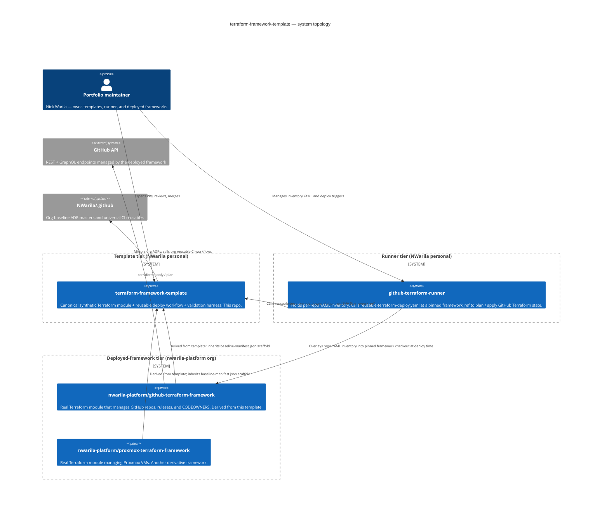

# Architecture

## System topology

Source: [docs/diagrams/architecture.mmd](../diagrams/architecture.mmd)

## Template boundary

`terraform-framework-template` is the reference Terraform framework template. It owns:

- A complete synthetic Terraform module under [`terraform/`](../../terraform/) that demonstrates framework structure without external services.
- The framework deploy reusable, [`reusable-terraform-deploy.yaml`](../../.github/workflows/reusable-terraform-deploy.yaml), which runner repos call for plan/apply.
- The release-evidence reusable, [`reusable-release-evidence.yaml`](../../.github/workflows/reusable-release-evidence.yaml), which the release workflow calls to attest release artifacts.
- A template-tier `baseline-manifest.json` for derivative frameworks that separates byte-identical scaffold from starter files derivatives rewrite.
- Framework-template ADRs under [`docs/decision-records/template/`](../decision-records/template/) that explain the shared framework decisions derivative frameworks inherit.
- The normalized Terraform CI harness under [`tools/ci/`](../../tools/ci/).

It does not own the universal security and release-automation workflows. CodeQL, Scorecard, IaC security, release-please, and trusted-bot auto-merge live in [`NWarila/.github`](https://github.com/NWarila/.github); this template's `security.yaml`, `release.yaml`, and `auto-merge.yaml` entrypoints only *call* those org reusables pinned by SHA.

It does not own runner inventory data. Runner repos keep `repos/public/` and `repos/private/` and overlay that data into a pinned framework checkout at validation or deploy time.

## Inputs and outputs

Derivative frameworks replace the synthetic providers, resources, repo-specific docs, and deploy pins while preserving the command surface:

- `python tools/verify.py ci` proves formatting, init, validate, TFLint, tests, OPA policy, docs, and manifest health.
- `python tools/verify.py integration` assembles an ephemeral framework workspace from `terraform/` plus an example tfvars file and runs the Terraform-facing gates.
- Runner repos call this framework's deploy reusable with a pinned `framework_ref` and explicit overlay paths. Pull requests normally use the local backend for plan-only validation. Trusted `main` deploys can opt into the caller-supplied S3 backend mode to prove OIDC, locking, apply, and remote state verification.

The reference framework's own validation intentionally uses a local backend so the template can run without credentials. Production frameworks should use the backend required by their consuming stack policy, and trusted runner deploys can pass those backend settings to the reusable workflow at runtime.

## External dependencies

- [`NWarila/.github`](https://github.com/NWarila/.github) provides org-baseline ADR masters mirrored under `docs/decision-records/org/`.
- [`NWarila/drift-gate`](https://github.com/NWarila/drift-gate) enforces byte-identical mirrors for org and template baseline files.
- Terraform, TFLint, OPA, and terraform-docs form the local and CI validation toolchain.
