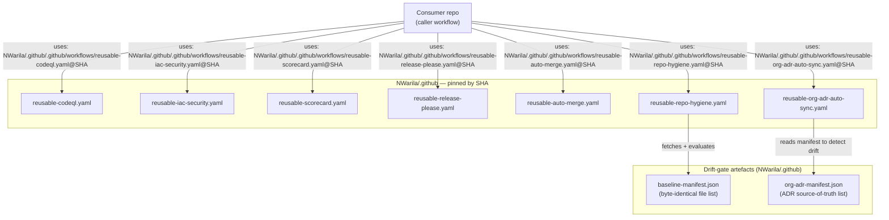

# Repo Type Taxonomy and CI Focus

The repository type determines what work a repository owns and therefore what its CI should prove. This explanation supports the reusable-workflow, repo-hygiene, and manifest-classification decisions in the org ADR set.

## Framework Repositories

Framework repositories host reusable framework logic for a stack. They do not usually produce the final deployable artifact themselves. Their job is to make downstream runners boring.

CI focus:

- Code quality and formatting.
- Security and policy correctness.
- Template contract correctness.
- Reproducibility of the framework path.
- Stack-specific reusable workflow behavior.
- Release evidence for the framework.

Framework repositories may carry local tools, tests, fixtures, policies, and verification scripts because those files prove the framework contract.

## Runner Templates

Runner templates define the narrow shape of repositories that execute a framework. They should be small and concrete: variables, a small number of resources, workflow callers, and the contract that binds them together.

CI focus:

- Does the runner shape satisfy the template contract?
- Are inherited org workflows called by pinned, namespace-local references?
- Does repo-hygiene cover the runner's workflow surface?
- Does the runner validate the execution path it owns?

Runner templates should avoid carrying framework-internal tools and tests unless the runner actually invokes them.

## Runner Consumers

Runner consumers supply repo-specific inputs and execute the framework to produce an artifact, apply infrastructure, or perform another concrete runtime outcome.

CI focus:

- Did the repository-specific inputs stay inside the expected contract?
- Did any secret or sensitive value leak?
- Did drift-gate confirm inherited governance and template files?
- Did the runtime or output verification pass?

Runner consumers should not have to ask whether the entire framework is sound. That proof belongs upstream.

## Control-Plane Repositories

Namespace `.github` repositories carry org governance: ADR baselines, community-health files, org policy, and universal reusable workflows.

CI focus:

- Are ADRs structurally valid and reviewable?
- Is the documentation layout sanctioned?
- Are baseline manifest entries real?
- Do universal reusable workflows pass source-side smoke tests?
- Does repo-hygiene pass against the control plane itself?
- Is public source-control hygiene clean?

## Reusable-Workflow Call Graph

The diagram below shows how a consumer repo calls the seven universal reusables
hosted in `NWarila/.github`, and how the drift-gate artefacts (`baseline-manifest.json`
and `org-adr-manifest.json`) relate to `reusable-repo-hygiene` and
`reusable-org-adr-auto-sync`.

Source: [docs/diagrams/reusable-workflow-call-graph.mmd](../diagrams/reusable-workflow-call-graph.mmd)

## Practical Consequence

The same governance doctrine can produce different visible file shapes. A framework template may enforce repo hygiene through `make ci`; a data-only runner may use a standalone caller. A control plane may own reusable workflow bodies; a consumer may only own thin callers. That variation is intentional when it follows repository responsibility.
