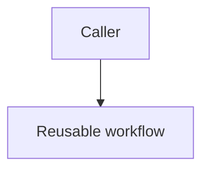

# Diagram Conventions

This is the canonical diagram-as-code convention for the NWarila template portfolio.

## Decision

Diagrams are authored as Mermaid source files with the `.mmd` extension under `docs/diagrams/`.

Diataxis pages embed the same Mermaid body inline in a fenced `mermaid` block so GitHub can render the diagram in place. The page must link to the matching `.mmd` source file immediately before or after the embedded diagram.

## Source Of Truth

The `.mmd` file is the source of truth. Inline Markdown embeds are rendered copies for reader ergonomics and must not drift from the source file.

Future enforcement should validate that an embedded Mermaid block matches the referenced `.mmd` source. Until that validator lands, reviewers should treat source/embed drift as a documentation defect.

## Repository Scope

Repo-specific diagrams are authored in the repository they describe and are validated for existence and shape only. They must not be added to byte-identical or sync-drift enforcement.

Fleet-canonical diagrams are authored in `NWarila/.github` first. Per-type templates may carry mirrored copies only when the mirror starts with a provenance note identifying the canonical source path in `NWarila/.github`.

## File Naming

Use lowercase, hyphen-separated names that describe the view, for example `runner-overlay-sequence.mmd` or `privileged-workflow-trust-boundary.mmd`.

Prefer C4-style context/container views for system topology and data-flow views for trust-boundary diagrams. Add deeper component-level diagrams only when the extra detail materially helps a maintainer or reviewer make a decision.

## Markdown Embed Pattern

Use this pattern in the Diataxis page that discusses the diagram:

````markdown
Source: [docs/diagrams/example-flow.mmd](../diagrams/example-flow.mmd)


````

The relative path may differ by page location. Keep the source link local when the diagram is repo-specific; use a canonical GitHub link only when referencing fleet-canonical material from a mirror.
